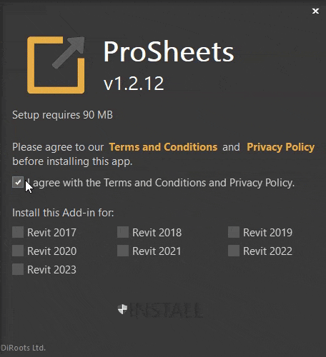
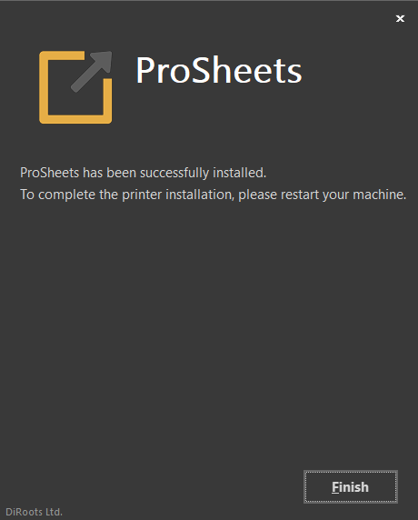
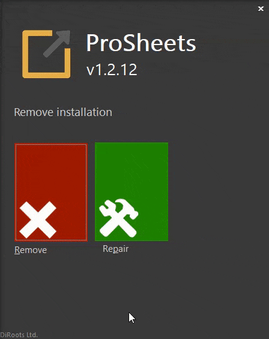
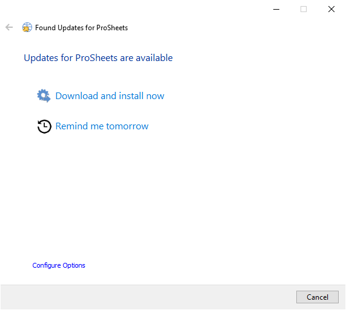

# Getting Started
{: .no_toc }

You can try DiStem for free during 15 days. To buy licenses for DiStem please contact our [Sales Team](mailto:sales@diroots.com). 

Not permitted:
-	Sell/resell
-	make modifications to the software.
{: .fs-6 .fw-300 }

## Table of contents
{: .no_toc .text-delta }

1. TOC
{:toc}

---

## Download

Download the [latest version of DiStem](https://diroots.com/revit-plugins/distem-bundle-for-autodesk-revit/).


## Install

### Compatibility
- Windows 7, 8, 10 and 11.
- Revit 2020, 2021, 2022 and 2023.

### Prerequisites
- Admin permissions.

```yaml
# Remarks
- the installation is done per-machine
- %ProgramData%\Autodesk\Revit\Addins\
```

### Standard Installation

```yaml
This method is ideal for individuals with admin permissions who want to install the app in one computer.
```

1. Close Revit.

2. Run the installer.

3. Select the Revit versions and click 'Install'.



4. Wait for the installation to complete and click 'Finish'.



### Silent Installation

```yaml
This method is ideal for IT administrators who want to deploy the app to multiple computers.
```

- Install for all compatible Revit versions.

```yaml
# This method will silently install ProSheets for all compatible Revit versions.
<installer-name>.exe /i // /qn accept_eula=1
```

- Exclude specific Revit versions.

```yaml
# In this example ProSheets will NOT be installed for Revit 2017, 2018, and 2019.
<installer-name>.exe /i // /qn accept_eula=1 revit2017="" revit2018="" revit2019=""
```

## Uninstall

### Using the installer User Interface

1. Run the installer.

2. Select and click 'Remove'.



3. Wait for the uninstallation to complete and click 'Finish'. 


### Using the installer silently

Uninstall the app without user interaction.

```yaml
# This command will remove the app from your computer.
<installer-name>.exe /x // /qn
```

### From the control panel

1. In the search box on the taskbar, type Control Panel and select it from the results.

2. Select Programs > Programs and Features.

3. Select the program you want to remove and select Uninstall or Uninstall/Change. Then follow the directions on the screen.

## Updates

This app includes an updater to help you keep it up to date. 
The updater will:
- notify you whenever a new version is released (the action is triggered on Revit close event).
- ask you to install now or to remind you tomorrow.



### Updater Settings

The following Update Options can be tweaked:
- activate automatic updates.
- check for updates frequency (the default value is 2 days). 
- change the downloads folder.

```yaml
# Pro Tip for Users
By default the automatic updates can't be disabled.
To go around it, you can set up the check for updates frequency to 365 days, for example.
# Keep in mind that it' recommended to keep your apps updated. Plus, we do not provide support for outdated applications.
```

```yaml
# Pro Tip for IT Administrators
By default the automatic updates can't be disabled.
To go around it, there's a configuration file that can be tweaked.

# Steps required
- go to %programdata%\<app-name>\Settings
- open the 'updater.ini' file
- Search for the line 'CheckFrequency=2' and change the value to 365, for example.

# Keep in mind that it' recommended to keep your apps updated. Plus, we do not provide support for outdated applications.
```
