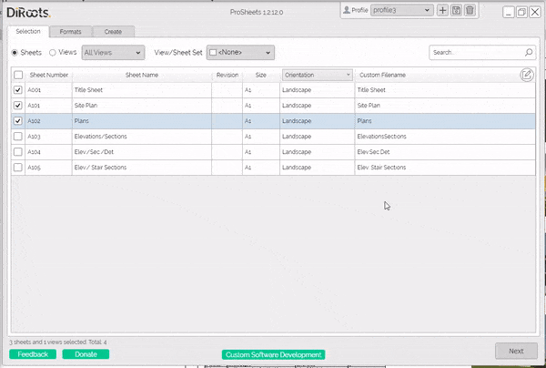

  


# 2D & 3D Measure Tool
{: .no_toc }
The 2D & 3D Measure Tool is an Autodesk Revit plugin that allows you to measure in a 2D and 3D views between 2 points or get XYZ coordinates from a single point.

## Core Features
{: .no_toc }
- Measure the distance between 2 points.
- Measure the length of an edge.
- Get XYZ coordinates from a single point.
- Copy the results to the clipboard.
- Export the results to Microsoft Excel. 

## Table of contents
{: .no_toc .text-delta }

1. TOC
{:toc}

---

## Measure the distance between 2 points

Steps:
1. Click on ruler icon.
2. Select 2 points.
3. The result will be automatically displayed in the plugin user interface.

  
<sub>Note: the version on the image may not reflect the [latest version](https://diroots.com/revit-plugins/revit-to-pdf-dwg-dgn-dwf-nwc-ifc-and-images-with-prosheets/).</sub>

## Measure the length of an edge

Steps:
1. Click on the edge measure icon.
2. Select a railing edge.
3. The result will be automatically displayed in the plugin user interface.

  
<sub>Note: the version on the image may not reflect the [latest version](https://diroots.com/revit-plugins/revit-to-pdf-dwg-dgn-dwf-nwc-ifc-and-images-with-prosheets/).</sub>

## Get XYZ coordinates from a single point

Steps:
1. Click on the marker icon.
2. Select a point.
3. The result will be automatically displayed in the plugin user interface.

  
<sub>Note: the version on the image may not reflect the [latest version](https://diroots.com/revit-plugins/revit-to-pdf-dwg-dgn-dwf-nwc-ifc-and-images-with-prosheets/).</sub>

## Copy the results to the clipboard

Steps:
1. Use any of the available measuring tools (between 2 points, edge length, and point coordinates).
2. Click on the copy to clipboard button.
3. The results are copied to your Windows clipboard.

```
Example of the data copied to the clipboard: 

Length = 10.8360749307321 millimeters
Δx = 0 Δy= -3.5527136788005E-15 Δz= 10.8360749307321
Pt1x= -21.7850015832099 Pt1y= -11.1666469113566 Pt1z= 8.85826771653543
Pt2x= -21.7850015832099 Pt2y= -11.1666469113566 Pt2z= 19.6943426472675
```

  
<sub>Note: the version on the image may not reflect the [latest version](https://diroots.com/revit-plugins/revit-to-pdf-dwg-dgn-dwf-nwc-ifc-and-images-with-prosheets/).</sub>

## Export the results to Microsoft Excel

Steps:
1. Use any of the available measuring tools (between 2 points, edge length, and point coordinates).
2. Click on the export to Excel button.
3. Choose the saving location and filename.
4. A confimation pop up will apper once the export to Excel is completed.

  
<sub>Note: the version on the image may not reflect the [latest version](https://diroots.com/revit-plugins/revit-to-pdf-dwg-dgn-dwf-nwc-ifc-and-images-with-prosheets/).</sub>