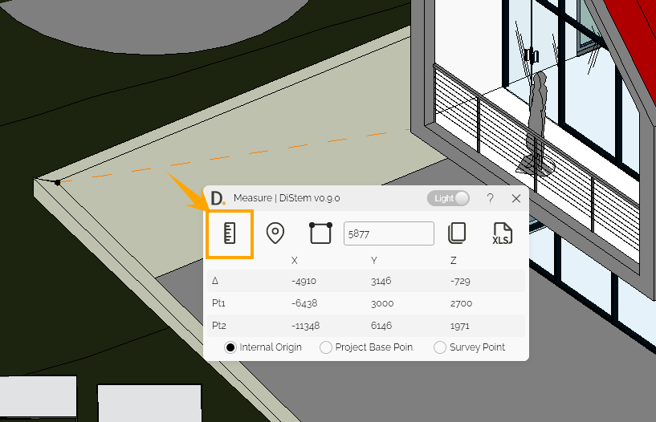

# 3D Ruler
{: .no_toc }
The 3D Ruler is an Autodesk Revit plugin that allows you to measure in a 2D and 3D views between 2 points or get XYZ coordinates from a single point.

## Core Features
{: .no_toc }
- Measure the distance between 2 points.
- Measure the length of an edge.
- Get XYZ coordinates from a single point.
- Copy the results to the clipboard.
- Export the results to Microsoft Excel. 

## Table of contents
{: .no_toc .text-delta }

1. TOC
{:toc}

---

## Measure the distance between 2 points

Steps:
1. Click on ruler icon.
2. Select 2 points.
3. The result will be automatically displayed in the plugin user interface.

  
<sub>Note: the version on the image may not reflect the [latest version](https://diroots.com/revit-plugins/distem-bundle-for-autodesk-revit/).</sub>

## Measure the length of an edge

Steps:
1. Click on the edge measure icon.
2. Select a railing edge.
3. The result will be automatically displayed in the plugin user interface.

  
<sub>Note: the version on the image may not reflect the [latest version](https://diroots.com/revit-plugins/distem-bundle-for-autodesk-revit/).</sub>

## Get XYZ coordinates from a single point

Steps:
1. Click on the marker icon.
2. Select a point.
3. The result will be automatically displayed in the plugin user interface.

  
<sub>Note: the version on the image may not reflect the [latest version](https://diroots.com/revit-plugins/distem-bundle-for-autodesk-revit/).</sub>

## Copy the results to the clipboard

Steps:
1. Use any of the available measuring tools (between 2 points, edge length, and point coordinates).
2. Click on the copy to clipboard button.
3. The results are copied to your Windows clipboard.

```
Example of the data copied to the clipboard: 

Length = 3303 millimeters
Δx = 0 Δy= 0 Δz= -3303
Pt1x= -6640 Pt1y= -3404 Pt1z= 6003
Pt2x= -6640 Pt2y= -3404 Pt2z= 2700
```

  
<sub>Note: the version on the image may not reflect the [latest version](https://diroots.com/revit-plugins/distem-bundle-for-autodesk-revit/).</sub>

## Export the results to Microsoft Excel

Steps:
1. Use any of the available measuring tools (between 2 points, edge length, and point coordinates).
2. Click on the export to Excel button.
3. Choose the saving location and filename.
4. A confimation pop up will apper once the export to Excel is completed.

  
<sub>Note: the version on the image may not reflect the [latest version](https://diroots.com/revit-plugins/distem-bundle-for-autodesk-revit/).</sub>