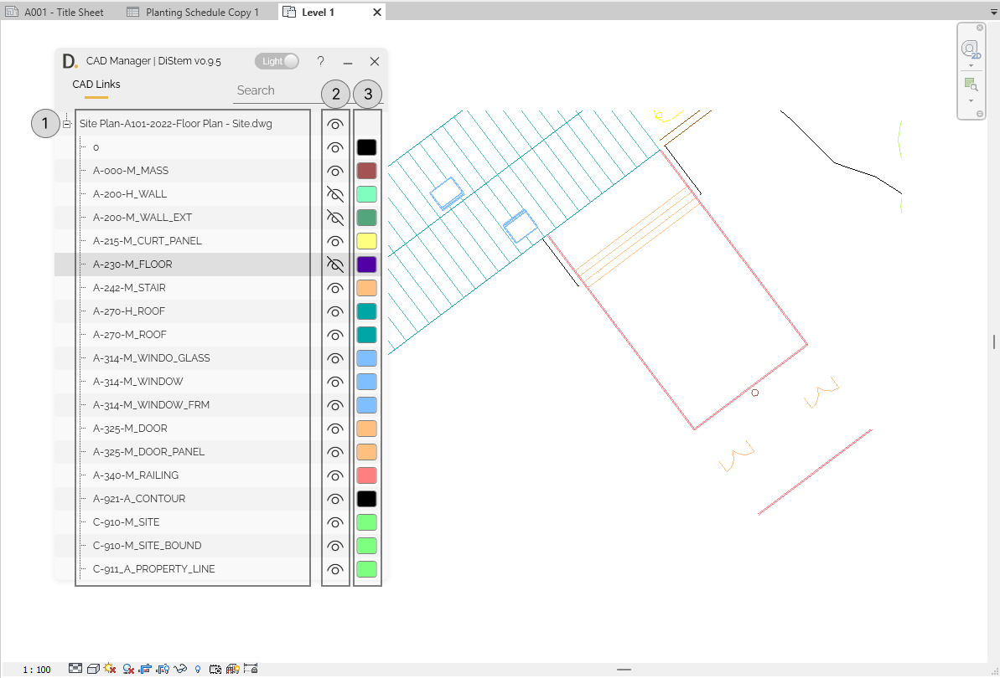

  

# CAD Manager
{: .no_toc }
The CAD Manager allows you to easily control the visibility and colors of the DWG layers. 

## Core Features
{: .no_toc }
- List all the layers of a DWG file imported to Revit.
- Easily Show/hide any layer.
- Easily modify the color of any layer. 

## Table of contents
{: .no_toc .text-delta }

1. TOC
{:toc}

---

## Show/hide and colorize the CAD Manager.

The CAD Manager provides a fast and user friendly way to show/hide and colorize the layers of the DWG file imported to Revit.

### Step by step 

  
Note: the version on the image may not reflect the latest version of the application.

1. Use the tree view to find the DWG layers.

2. Use the eye button icon to show/hide layers.

3. Use the color button to modify the color of the layers.

# CAD to Revit (Coming Soon)
{: .no_toc }
Coming Soon!