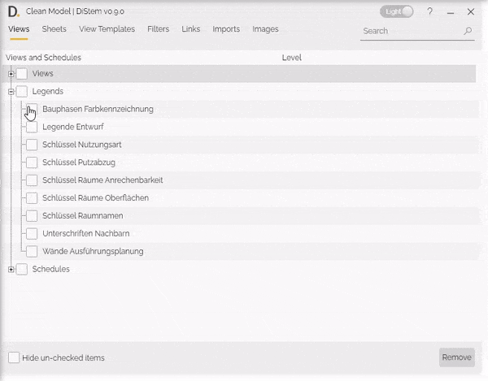

  

# Model Cleanup Tool
{: .no_toc }
The Model Cleanup Tool allows you to quickly batch delete Views, Schedules, Sheets, View Templates, Filters, Links, Imports and Images from your Revit Models. Easily select the elements you want to remove and remove them all with a single click.

## Core Features
{: .no_toc }
- batch delete Views, Schedules, Sheets, View Templates, Filters, Links, Imports and Images.
- Items grouped in tabs with multiple sort and search options.

## Table of contents
{: .no_toc .text-delta }

1. TOC
{:toc}

---

## Select the items to be removed

The Model Cleanup Tool provides a fast and user friendly way to select the model items that you want to clean from the model.

### Step by step 

  
Note: the version on the image may not reflect the latest version of the application.

1. Switch between the tabs and select the Views, Schedules, Sheets, View Templates, Filters, Links, Imports and Images to be removed from the model.

2. Click on the 'Remove' button.

3. It will pop up a confirmation dialog with a list of all items that will be removed. Confirm to proceed with the operation.
