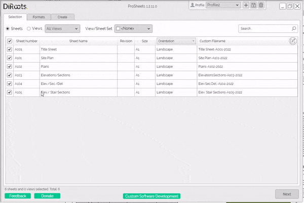

# Properties Extraction & Mapping Tool
{: .no_toc }
The Properties Extraction and Mapping Tool allows you to quickly extract hidden parameters and properties (e.g., Location - X,Y,Z Coordinates) from the model and inject them into existing or new instance parameters.

## Core Features
{: .no_toc }
- Extract inaccessible properties/parameters from the model elements and inject them into new or existing instance shared parameters
- Find the hidden properties/parameters in whole model, current view or current selection
- Find the hidden properties/parameters by category/subcategory
- Support properties/parameters: Location Points (Project Base Point, Revit Internal Origin, Survey Point), Connectors, GUID/UniqueID, Flipped face orientation, etc. This point will be explained in more detail in the next section.

## Table of contents
{: .no_toc .text-delta }

1. TOC
{:toc}

---

## Select properties/parameters tab

Use this tab to select the properties/parameters to be mapped.

### Elements selection and filtering options

This tool comes with a variety of features to help you to quickly select the elements that you want to extract properties/parameters from.

- Whole Model, Active View, and Current Selection
- By Category/Subcategory using the tree view.
- Search bar

### Properties/parameters selection and filtering options

This tool comes with a variety of features to help you to quickly select the properties/parameters that you want to extract from the model elements.

- By property/parameter type (e.g., all location properties) and name (e.g., Location Point - XYZ coordinates) using the tree view.
- Search bar

Steps:

1. Click radio buttons to collect the elemnts from the Whole Model, Active View, or Current Selection. 

```yaml
The 'Sheets' radio button will show the existing sheets in the project.  
The 'Views' radio button will show the existing views in the project.  
```

2. Use the checkboxes from the tree view to select specific categories/subcategories or use the checkbox in the table header to select all categories/subcategories.

  
<sub>Note: the version on the image may not reflect the [latest version of ProSheets](https://diroots.com/revit-plugins/revit-to-pdf-dwg-dgn-dwf-nwc-ifc-and-images-with-prosheets/).</sub>

3. Use the checkboxes from the tree view to select specific properties/parameters to be mapped.

4. Click on the  'Map and Extract' button to move to the 'Create Parameters' tab and start the mapping and extraction process.

---

## Sort, Filter and Search

ProSheets has options to sort, filter, and search to ease the selection.

### Sort

Click on the table headers to sort the views/sheets by one of the available parameters.  


```yaml
# Note:  
The 5th column in sheet list contains a dropdown that allows you select to any other instance parameter available on your sheets.  
Examples - Current Review Date, Approved By, Appears on Sheet List, etc. 
The default is Orientation.
```
  

  
<sub>Note: the version on the image may not reflect the [latest version of ProSheets](https://diroots.com/revit-plugins/revit-to-pdf-dwg-dgn-dwf-nwc-ifc-and-images-with-prosheets/).</sub>


### Filter

Filtering options available:
1. Radio button to switch between sheets and views
2. Dropdown to filter by view type (e.g., 3D, Floor Plan, Section, Detail, etc.)
3. Dropdown with checkboxes to filter by view/sheet sets.

  
<sub>Note: the version on the image may not reflect the [latest version of ProSheets](https://diroots.com/revit-plugins/revit-to-pdf-dwg-dgn-dwf-nwc-ifc-and-images-with-prosheets/).</sub>

### Search

The search box will search for text contained in any of the existing columns (including the customizable column).  
  
---

For example, you can find Sheets by:
- Sheet Number
- Sheet Name
- Revision
- Size (e.g., A1, A0, etc.)
- Any instance parameter available in the customizable column
- Custom filename

---

For example, you can find Views by:
- View Name
- Scale
- Detail Level
- Discipline
- Custom filename

  
<sub>Note: the version on the image may not reflect the [latest version of ProSheets](https://diroots.com/revit-plugins/revit-to-pdf-dwg-dgn-dwf-nwc-ifc-and-images-with-prosheets/).</sub>

---

## Naming Rules

The custom filename builder allows you to quickly set how you want your files to be named.

Main features:
- Parametric filenaming (using Sheet/View and Project Information parameters)
- Set generic field separator (e.g., SheetName-ShetNumber)
- Set custom fields Separators (e.g., SheetName-ShetNumber_Rev1)
- Custom static fields  (e.g., SheetName-ShetNumber-MyStaticField)
- Other non-Revit parameters (e.g., Current Month, Day, Hour, etc.)

  
<sub>Note: the version on the image may not reflect the [latest version of ProSheets](https://diroots.com/revit-plugins/revit-to-pdf-dwg-dgn-dwf-nwc-ifc-and-images-with-prosheets/).</sub>

---